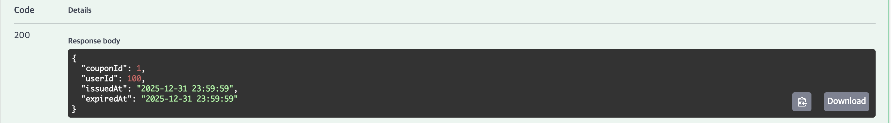

# API 명세서

## 유저 잔액 조회

### Parameters

### Responses

## 유저 포인트 충전

### Parameters

### Request body

### Responses

## 상품 조회

### Parameters

### Responses

## 인기 상품 조회

### Responses

## 인기 상품 통계 데이터 전송

### Request body

### Responses

## 주문 결제

### Request body

### Responses

## 유저 보유 쿠폰 조회

### Parameter

### Responses

## 선착순 쿠폰 발급

### Request body

### Responses

