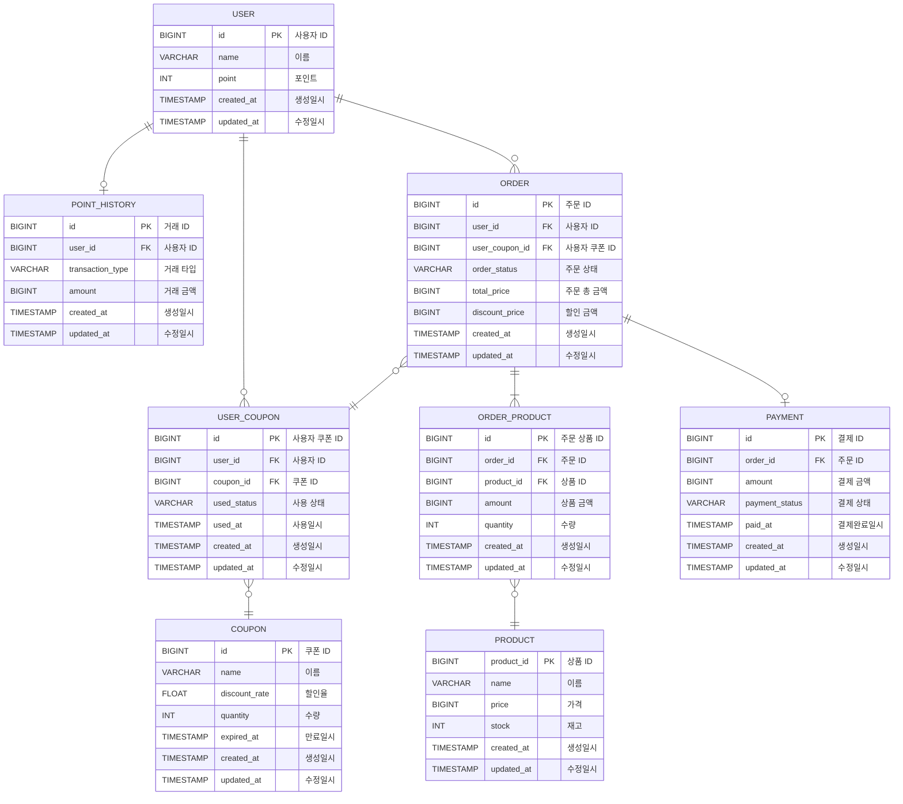

### ERD 작성

```mermaid
erDiagram
USER ||--o| POINT_HISTORY: ""

    USER ||--o{ USER_COUPON: ""
    USER_COUPON }o--||COUPON: ""

    USER ||--o{ ORDER: ""
    ORDER }o--|| USER_COUPON: ""
    ORDER ||--|{ ORDER_PRODUCT: ""
    ORDER_PRODUCT }o--|| PRODUCT: ""

    ORDER ||--o| PAYMENT: ""

    USER {
        BIGINT id PK "사용자 ID"
        VARCHAR name "이름"
        INT point "포인트"
        TIMESTAMP created_at "생성일시"
        TIMESTAMP updated_at "수정일시"
    }
    
    POINT_HISTORY {
        BIGINT id PK "거래 ID"
        BIGINT user_id FK "사용자 ID"
        VARCHAR transaction_type "거래 타입"
        BIGINT amount "거래 금액"
        TIMESTAMP created_at "생성일시"
        TIMESTAMP updated_at "수정일시"
    }

    USER_COUPON {
        BIGINT id PK "사용자 쿠폰 ID"
        BIGINT user_id FK "사용자 ID"
        BIGINT coupon_id FK "쿠폰 ID"
        VARCHAR used_status "사용 상태"
        TIMESTAMP used_at "사용일시"
        TIMESTAMP created_at "생성일시"
        TIMESTAMP updated_at "수정일시"
    }

    COUPON {
        BIGINT id PK "쿠폰 ID"
        VARCHAR name "이름"
        FLOAT discount_rate "할인율"
        INT quantity "수량"
        TIMESTAMP expired_at "만료일시"
        TIMESTAMP created_at "생성일시"
        TIMESTAMP updated_at "수정일시"
    }

    ORDER {
        BIGINT id PK "주문 ID"
        BIGINT user_id FK "사용자 ID"
        BIGINT user_coupon_id FK "사용자 쿠폰 ID"
        VARCHAR order_status "주문 상태"
        BIGINT total_price "주문 총 금액"
        BIGINT discount_price "할인 금액"
        TIMESTAMP created_at "생성일시"
        TIMESTAMP updated_at "수정일시"
    }

    ORDER_PRODUCT {
        BIGINT id PK "주문 상품 ID"
        BIGINT order_id FK "주문 ID"
        BIGINT product_id FK "상품 ID"
        BIGINT amount "상품 금액"
        INT quantity "수량"
        TIMESTAMP created_at "생성일시"
        TIMESTAMP updated_at "수정일시"
    }

    PRODUCT {
        BIGINT product_id PK "상품 ID"
        VARCHAR name "이름"
        BIGINT price "가격"
        INT stock "재고"
        TIMESTAMP created_at "생성일시"
        TIMESTAMP updated_at "수정일시"
    }

    PAYMENT {
        BIGINT id PK "결제 ID"
        BIGINT order_id FK "주문 ID"
        BIGINT amount "결제 금액"
        VARCHAR payment_status "결제 상태"
        TIMESTAMP paid_at "결제완료일시"
        TIMESTAMP created_at "생성일시"
        TIMESTAMP updated_at "수정일시"
    }
```