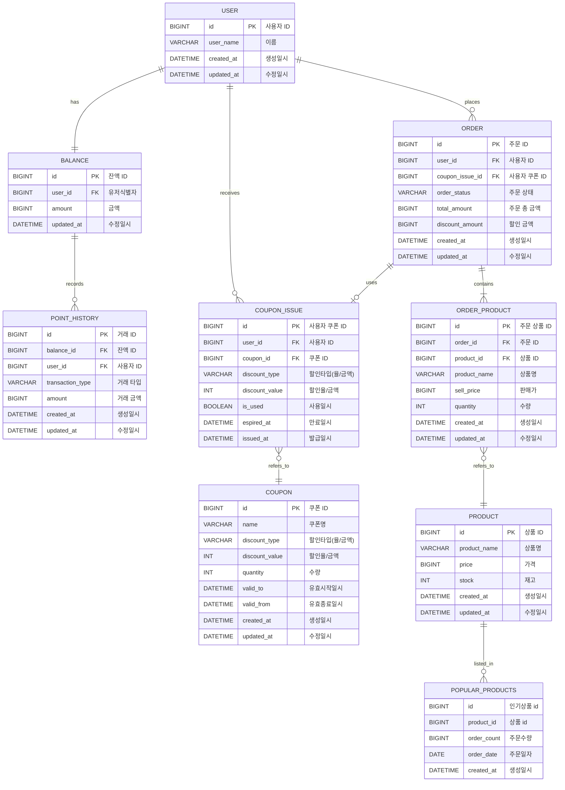

### ERD 작성

```mermaid
erDiagram
    USER ||--|| BALANCE : "has"
    BALANCE ||--o{ POINT_HISTORY : "records"

    USER ||--o{ COUPON_ISSUE : "receives"
    COUPON_ISSUE }o--|| COUPON : "refers_to"

    USER ||--o{ ORDER : "places"
    ORDER ||--o| COUPON_ISSUE : "uses"
    ORDER ||--|{ ORDER_PRODUCT : "contains"
    ORDER_PRODUCT }o--|| PRODUCT : "refers_to"
    PRODUCT ||--o{ POPULAR_PRODUCTS : "listed_in"

    USER {
        BIGINT id PK "사용자 ID"
        VARCHAR user_name "이름"
        DATETIME created_at "생성일시"
        DATETIME updated_at "수정일시"
    }

    BALANCE {
        BIGINT id PK "잔액 ID"
        BIGINT user_id FK "유저식별자"
        BIGINT amount "금액"
        DATETIME updated_at "수정일시"
    }
    
    POINT_HISTORY {
        BIGINT id PK "거래 ID"
        BIGINT balance_id FK "잔액 ID"
        BIGINT user_id FK "사용자 ID"
        VARCHAR transaction_type "거래 타입"
        BIGINT amount "거래 금액"
        DATETIME created_at "생성일시"
        DATETIME updated_at "수정일시"
    }

    COUPON_ISSUE {
        BIGINT id PK "사용자 쿠폰 ID"
        BIGINT user_id FK "사용자 ID"
        BIGINT coupon_id FK "쿠폰 ID"
        VARCHAR discount_type "할인타입(율/금액)"
        INT discount_value "할인율/금액"
        BOOLEAN is_used "사용일시"
        DATETIME espired_at "만료일시"
        DATETIME issued_at "발급일시"
    }

    COUPON {
        BIGINT id PK "쿠폰 ID"
        VARCHAR name "쿠폰명"
        VARCHAR discount_type "할인타입(율/금액)"
        INT discount_value "할인율/금액"
        INT quantity "수량"
        DATETIME valid_to "유효시작일시"
        DATETIME valid_from "유효종료일시"
        DATETIME created_at "생성일시"
        DATETIME updated_at "수정일시"
    }

    ORDER {
        BIGINT id PK "주문 ID"
        BIGINT user_id FK "사용자 ID"
        BIGINT coupon_issue_id FK "사용자 쿠폰 ID"
        VARCHAR order_status "주문 상태"
        BIGINT total_amount "주문 총 금액"
        BIGINT discount_amount "할인 금액"
        DATETIME created_at "생성일시"
        DATETIME updated_at "수정일시"
    }

    ORDER_PRODUCT {
        BIGINT id PK "주문 상품 ID"
        BIGINT order_id FK "주문 ID"
        BIGINT product_id FK "상품 ID"
        VARCHAR product_name "상품명"
        BIGINT sell_price "판매가"
        INT quantity "수량"
        DATETIME created_at "생성일시"
        DATETIME updated_at "수정일시"
    }

    PRODUCT {
        BIGINT id PK "상품 ID"
        VARCHAR product_name "상품명"
        BIGINT price "가격"
        INT stock "재고"
        DATETIME created_at "생성일시"
        DATETIME updated_at "수정일시"
    }

    POPULAR_PRODUCTS {
        BIGINT id "인기상품 id"
        BIGINT product_id "상품 id"
        BIGINT order_count "주문수량"
        DATE order_date "주문일자"
        DATETIME created_at "생성일시"
    }
```