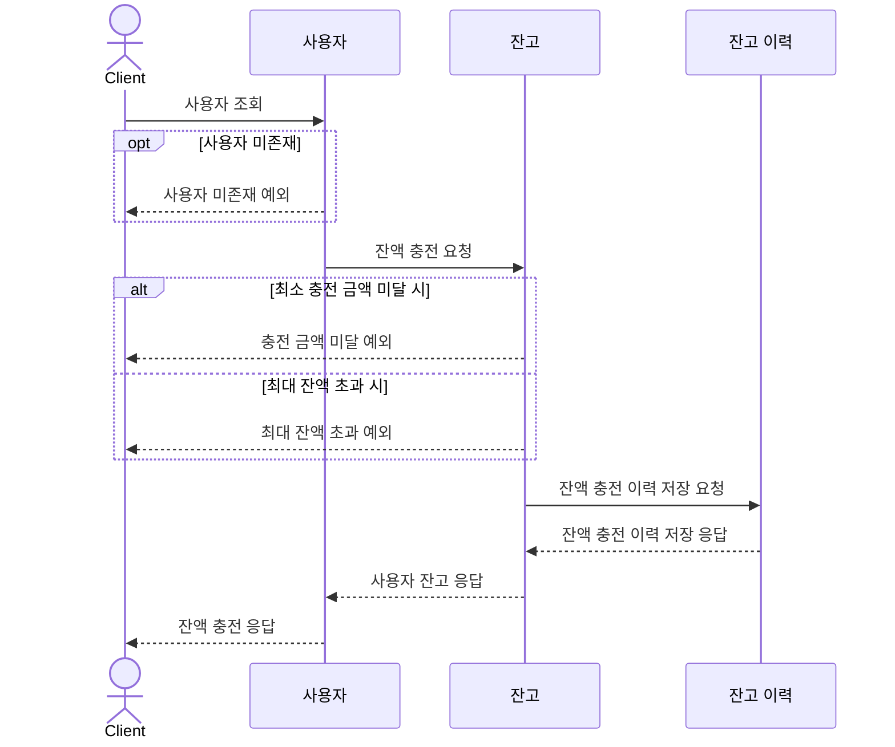
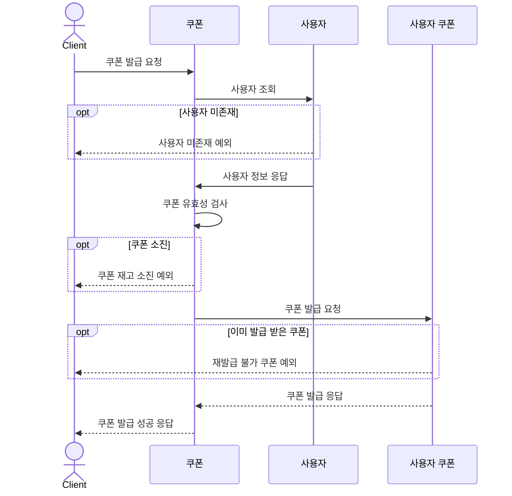
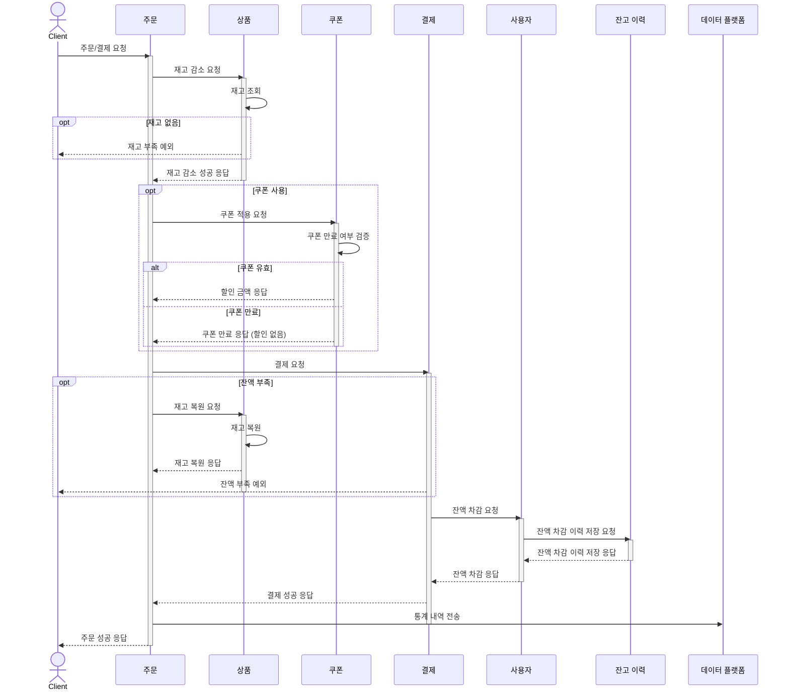

### 잔액 충전

```mermaid
sequenceDiagram
  actor Client
  participant 사용자
  participant 잔고
  participant 잔고 이력

  Client->>사용자: 사용자 조회
    opt 사용자 미존재
        사용자-->>Client: 사용자 미존재 예외
    end

  사용자 ->> 잔고: 잔액 충전 요청

  alt 최소 충전 금액 미달 시
    잔고-->>Client: 충전 금액 미달 예외
  else 최대 잔액 초과 시
    잔고-->>Client: 최대 잔액 초과 예외
  end

  잔고 ->> 잔고 이력: 잔액 충전 이력 저장 요청
  잔고 이력 -->> 잔고: 잔액 충전 이력 저장 응답

  잔고-->>사용자: 사용자 잔고 응답
  사용자 -->> Client: 잔액 충전 응답
```

### 쿠폰 발급

```mermaid
sequenceDiagram
    actor Client
    
    Client->>쿠폰: 쿠폰 발급 요청
    쿠폰->>사용자: 사용자 조회
    
    opt 사용자 미존재
        사용자-->>Client: 사용자 미존재 예외
    end

    사용자->>쿠폰: 사용자 정보 응답
    쿠폰->>쿠폰: 쿠폰 유효성 검사

    opt 쿠폰 소진
        쿠폰-->>Client: 쿠폰 재고 소진 예외
    end

    쿠폰->>사용자 쿠폰: 쿠폰 발급 요청
    opt 이미 발급 받은 쿠폰
        사용자 쿠폰-->>Client: 재발급 불가 쿠폰 예외
    end

    사용자 쿠폰-->>쿠폰: 쿠폰 발급 응답
    쿠폰-->>Client:쿠폰 발급 성공 응답
```

### 주문 및 결제 완료

```mermaid
sequenceDiagram
    actor Client
    participant 주문
    participant 상품
    participant 쿠폰
    participant 결제
    participant 사용자
    participant 잔고 이력
    participant 데이터 플랫폼

    Client->>주문: 주문/결제 요청

    activate 주문
    주문->>상품: 재고 감소 요청

    activate 상품
    상품->>상품: 재고 조회

    opt 재고 없음
        상품-->>Client: 재고 부족 예외
    end

    상품-->>주문: 재고 감소 성공 응답
    deactivate 상품

    opt 쿠폰 사용
        주문->>쿠폰: 쿠폰 적용 요청
        activate 쿠폰
        쿠폰->>쿠폰: 쿠폰 만료 여부 검증

        alt 쿠폰 유효
            쿠폰-->>주문: 할인 금액 응답
        else 쿠폰 만료
            쿠폰-->>주문: 쿠폰 만료 응답 (할인 없음)
        end
        deactivate 쿠폰
    end

    주문->>결제: 결제 요청
    activate 결제

    opt 잔액 부족
        주문->>상품: 재고 복원 요청
        activate 상품
        상품->>상품:재고 복원
        상품-->>주문: 재고 복원 응답
        결제-->>Client: 잔액 부족 예외
        deactivate 상품
    end        

    결제->>사용자: 잔액 차감 요청
    activate 사용자
    
    사용자->>잔고 이력: 잔액 차감 이력 저장 요청
    activate 잔고 이력
    잔고 이력-->>사용자: 잔액 차감 이력 저장 응답
    deactivate 잔고 이력
    
    사용자-->>결제: 잔액 차감 응답
    deactivate 사용자

    결제-->>주문: 결제 성공 응답

    주문->>데이터 플랫폼: 통계 내역 전송

    deactivate 결제
    주문-->>Client: 주문 성공 응답
    deactivate 주문
```